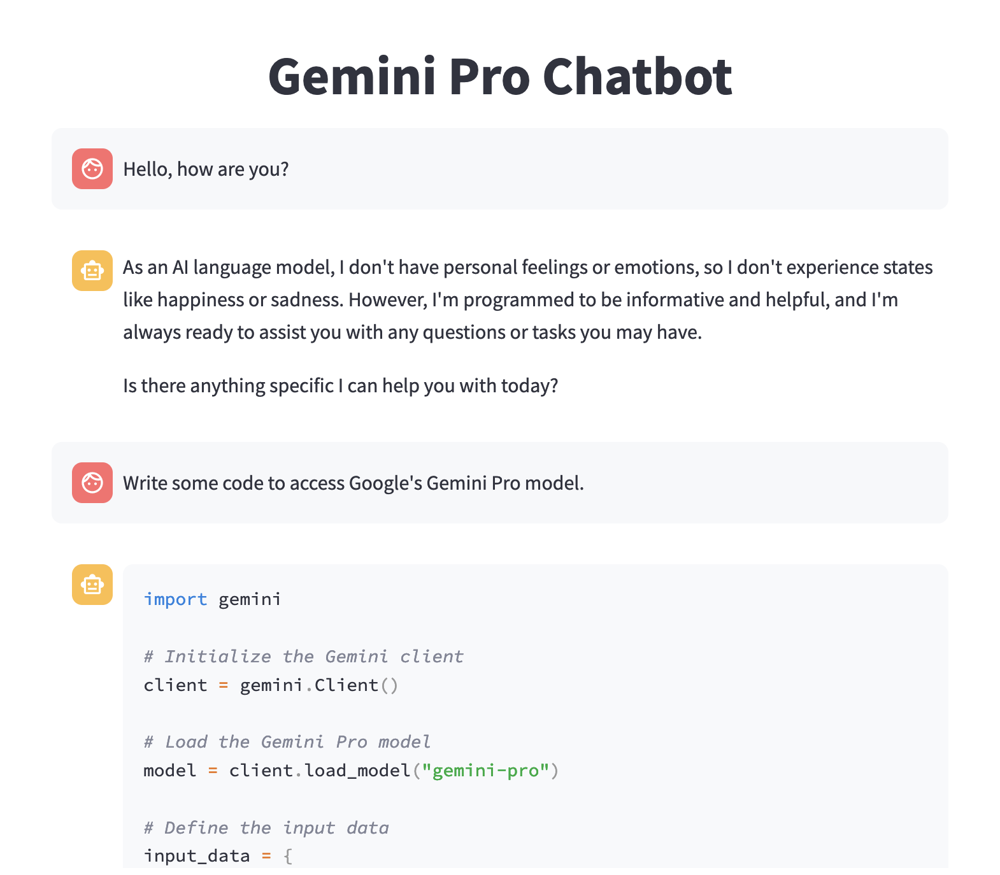

# Quickstart
# Source: https://sparkapps.net/building-a-gemini-pro-chatbot-with-googles-latest-model/
# Source: https://github.com/marshmellow77/vertex-gemini/blob/main/chatbot-gemini.py

Using Gemini Pro via Google's Vertex APIs. 
create virtual environment via 
'python3 -m venv .venv'
'source .venv/bin/activate'

Install required packages:
'pip3 install -r requirements.txt'

Set your Google project that allows access to Gemini models:
'gcloud config set project cloud-llm-preview1'

Authenticate with application defaults (for more see https://cloud.google.com/docs/authentication/provide-credentials-adc#local-user-cred)
'gcloud auth application-default login'

To run the app use `streamlit run chatbot-gemini.py`

